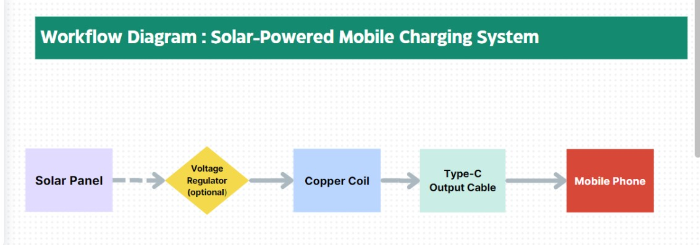

🔋 Solar-Powered Mobile Charging System
This is a simple portable mobile charging system that runs completely on solar energy. It delivers a stable 5V output through a Type-C connection — without any microcontroller or code.

⚙️ Components Used

- 5V Solar Panel
- Type-C Cable (cut from charger)
- Copper Wire (coil)
- Wires (red & black)
- Multimeter (for testing)
- Voltage Regulator (optional)

🔌 Working Principle

- The solar panel collects sunlight and provides DC voltage output.
- Positive and negative wires from a Type-C cable are connected to the solar panel output.
- A voltage regulator is optionally used to stabilize voltage to 5V.
- The system is tested using a multimeter before connecting the phone.
- Final output is connected via Type-C to the mobile → it charges using solar energy.

🧠 Workflow Diagram

 ✅ Status

- Tested successfully on real device
- No microcontroller or code required
- Fully hardware-based and eco-friendly solution

📌 Future Scope

- Add USB ports to charge multiple devices
- Add indicator LED for live charging status
- Integrate with power bank for backup storage
